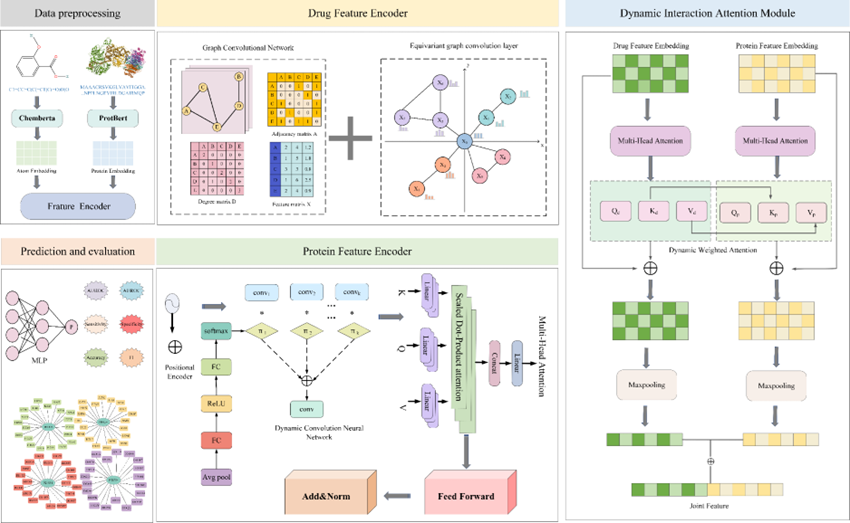

## LDM-DTI

LDM-DTI is a multimodal framework for drug-target interaction prediction, combining pretrained language models and geometric graph networks.

## Introduction

This repository contains the LDM-DTI implementation. The model integrates Transformer-based sequence encoders, EGNN-based geometric representation learning, and cross-attention fusion for DTI prediction.

## Framework



## Project Structure

```text
LDM-DTI/
├── src/
│   ├── core/              # Training entry and runtime utilities
│   ├── models/            # Model building blocks and network definitions
│   ├── data/              # Dataset and data loader code
│   └── config/            # Training configuration
├── scripts/               # Auxiliary runnable scripts
├── data/
│   ├── raw/               # Standalone raw csv files
│   └── sample/            # Dataset splits by dataset_name/split_name
├── outputs/               # Training outputs and artifacts
├── docs/                  # Additional documentation
├── main.py                # Root entrypoint (delegates to src/core/main.py)
├── requirements.txt
└── README.md
```

## Data Layout

Training data is expected under:

```text
data/<dataset_name>/<split_name>/
├── train.csv
├── val.csv
└── test.csv
```

Example in this repo:

```text
data/sample/random/
├── train.csv
├── val.csv
└── test.csv
```

## Setup

```bash
python -m pip install -r requirements.txt
```

## Usage

Run training from the project root:

```bash
python main.py --data sample --split random
```

Run CSV validation script:

```bash
python scripts/check_csv.py
```
