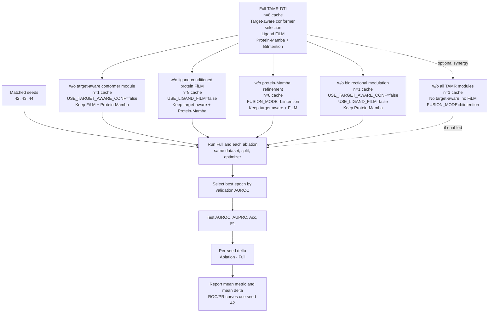

# Stage 2 实验计划

本阶段目标是在不 rerun 原论文 LDM-DTI baseline 的前提下，完成 TAMR-DTI 的正式主实验、创新点消融和多构象对比。原论文 LDM-DTI 及其他 baseline 结果直接引用原论文表格；本地实验统一使用现有 split，并以 validation AUROC 选择 best epoch。

## A. 主实验

### A1. 四数据集 TAMR-DTI 主结果

数据集：

- BindingDB
- BioSNAP
- Human
- C.elegans

主模型：

- Full TAMR-DTI
- 建议以 `M1-g2-n8` 作为主模型配置

重复次数：

- 每个数据集 5 seeds
- 推荐 seeds：`42, 43, 44, 45, 46`

选模口径：

- 用 validation AUROC 选择 best epoch
- 报告该 best epoch 对应的 test AUROC / AUPRC / Acc / F1
- 禁止用 test AUROC 或 test Acc 选择 best epoch
- Acc / F1 的阈值只能在 validation set 上确定，然后固定用于 test set

配置要求：

```yaml
SOLVER:
  BEST_METRIC: auroc
```

或运行时显式指定：

```bash
--best_metric auroc
```

主实验输出：

- 四数据集 AUROC / AUPRC / Acc / F1 的 `mean ± std`
- 四数据集 AUPRC / Acc / F1 的 95% confidence interval
- 四数据集 Accuracy 箱线图，对齐原论文 Fig. 2 的稳定性展示风格

### A2. 与原论文主表对比

主表包含：

- SVM
- RF
- KNN
- LR
- GraphDTA
- DrugBAN
- IIFDTI
- TransformerCPI
- MolTrans
- BINDTI
- LDM-DTI reported
- TAMR-DTI

说明：

- 不 rerun LDM-DTI baseline，直接引用原论文 LDM-DTI reported。
- TAMR-DTI 使用本阶段 5 seeds 的 `mean ± std`。
- 只做数值对比，不计算 TAMR-DTI vs 原论文 LDM-DTI 的 p-value，因为没有原论文每个 fold/seed 的原始结果。

## B. 稳定性统计

稳定性统计只基于主实验的 Full TAMR-DTI 5 seeds。

### B1. Confidence Interval

对每个数据集、每个指标的 5 次结果计算：

```text
95% CI = mean ± t * std / sqrt(5)
```

其中 n=5 时：

```text
t = 2.776
```

建议报告：

- AUPRC 95% CI
- Acc 95% CI
- F1 95% CI

可选报告：

- AUROC 95% CI

### B2. Accuracy 箱线图

使用四个数据集各自 5 seeds 的 test Accuracy 绘制箱线图：

- BindingDB
- BioSNAP
- Human
- C.elegans

图的作用：

- 对齐原论文五次随机实验 Accuracy 箱线图的展示方式
- 说明 TAMR-DTI 在不同数据集上的稳定性

注意：

- 如果使用固定 split + 5 seeds，应写作 five-seed repeated experiments。
- 只有重新构造 5 folds 并逐 fold 训练，才能严格称为 five-fold cross-validation。

## C. 创新点消融

现有 seed=42 消融结果不能直接作为最终论文消融。主要原因是：

1. 当前 `w/o target-aware conformer selection` 的配置是 `NUM_CONFORMERS=8` 且 `USE_TARGET_AWARE_CONF=false`，代码会把构象 logits 置零并对 8 个有效构象做 uniform softmax。因此它实际验证的是“去掉 target-conditioned scoring 后的 8 构象等权聚合”，不是去掉 target-aware 多构象模块。
2. 当前单 seed 结果存在明显翻转。BioSNAP 上 `w/o protein-Mamba refinement` 的 test AUROC 比 Full 高 0.0007，但 AUPRC 低 0.0025；这种量级不能用单 seed 下结论。
3. 当前模块贡献是小幅增益，不像原论文去掉 GCN/EGNN/DCNN/DIAM 那样会直接移除整条强表征分支。因此最终消融必须使用 matched seeds，并报告相对 Full 的 matched-seed delta。

### C0. 已有消融记录的状态

以下结果只作为诊断记录，不直接写入最终论文消融表。

| 数据集 | 消融项 | 当前配置语义 | test AUROC delta | test AUPRC delta | 判断 |
| --- | --- | --- | ---: | ---: | --- |
| BindingDB | w/o target-aware scoring | 8 构象 uniform pooling | -0.0010 | +0.0002 | 语义不适合作为最终 target-aware module 消融 |
| BindingDB | w/o FiLM | 保留 target-aware conformer + Mamba | -0.0042 | -0.0059 | 有下降，可复查多 seed |
| BindingDB | w/o Mamba | 保留 target-aware conformer + FiLM，fusion 回退 BiIntention | -0.0040 | -0.0052 | 有下降，可复查多 seed |
| BioSNAP | w/o target-aware scoring | 8 构象 uniform pooling | -0.0049 | -0.0066 | 有下降，但语义仍是 uniform pooling |
| BioSNAP | w/o FiLM | 保留 target-aware conformer + Mamba | -0.0025 | -0.0053 | AUPRC 有下降，Acc/F1 不稳定 |
| BioSNAP | w/o Mamba | 保留 target-aware conformer + FiLM，fusion 回退 BiIntention | +0.0007 | -0.0025 | 单 seed 不足以下结论 |

### C1. 最终消融原则

最终论文消融不再使用单 seed 口径。推荐使用 3 seeds matched ablation：

```text
seeds = 42, 43, 44
```

如果算力允许，再扩展到主实验同一组 5 seeds：

```text
seeds = 42, 43, 44, 45, 47
```

所有消融必须满足：

- 与 Full 使用同一 dataset / split / cache / optimizer / scheduler / epoch 上限。
- 使用 validation AUROC 选择 best epoch。
- test 指标只来自该 best epoch。
- 每个 seed 内先计算 `Ablation - Full`，再汇总 matched-seed delta 的 mean。
- 不做 p-value；3 seeds 时不建议写 confidence interval。
- ROC / PR curve 使用 seed=42 的 best checkpoint 作为可视化，表格使用 matched-seed 均值。

### C2. 最终消融模型

最终消融表建议包含 5 行。前 4 行是论文主表必需，最后 1 行用于证明 bidirectional modulation 的整体作用。这里的 `w/o` 不是把表示向量置零，而是把对应创新模块替换成一个可训练、可解释的基础路径。

| 实验 | 去掉什么 | 替换成什么 | 关键配置 | 目的 |
| --- | --- | --- | --- | --- |
| Full TAMR-DTI | 无 | 完整 TAMR-DTI | `cache_root=cache/features`, `NUM_CONFORMERS=8`, `USE_TARGET_AWARE_CONF=true`, `USE_LIGAND_FILM=true`, `FUSION_MODE=protein_mamba_biintention` | 主参考 |
| w/o target-aware conformer module | 去掉 protein/energy-conditioned conformer scoring 和多构象选择 | 单构象 EGNN 路径：只保留第 1 个有效构象，softmax 权重退化为 `[1,0,...,0]`；不是 8 构象平均 | `cache_root=cache/features_n1`, `NUM_CONFORMERS=1`, `USE_TARGET_AWARE_CONF=false`, `USE_LIGAND_FILM=true`, `FUSION_MODE=protein_mamba_biintention` | 验证 target-aware conformer module 的整体贡献 |
| w/o ligand-conditioned protein FiLM | 去掉 ligand-to-protein 的 FiLM 调制，即不再使用 drug context 产生 `gamma/beta` | 基础 ProteinACmix 路径：protein token 只经过原本的 FF + CNNTrans 层；等价于 FiLM identity modulation (`gamma=0`, `beta=0`) | `cache_root=cache/features`, `NUM_CONFORMERS=8`, `USE_TARGET_AWARE_CONF=true`, `USE_LIGAND_FILM=false`, `FUSION_MODE=protein_mamba_biintention` | 验证 ligand-conditioned protein modulation 的贡献 |
| w/o protein-Mamba refinement | 去掉 protein token 上的 Mamba residual refinement | 直接把 ProteinACmix 输出送入 BiIntention；等价于 protein residual identity，不做 Mamba sequence refinement | `cache_root=cache/features`, `NUM_CONFORMERS=8`, `USE_TARGET_AWARE_CONF=true`, `USE_LIGAND_FILM=true`, `FUSION_MODE=biintention` | 验证 protein-side Mamba refinement 的贡献 |
| w/o bidirectional modulation | 同时去掉 protein-to-drug conformer modulation 和 ligand-to-protein FiLM | drug 侧回退单构象 EGNN；protein 侧回退基础 ProteinACmix；仍保留 protein-Mamba + BiIntention | `cache_root=cache/features_n1`, `NUM_CONFORMERS=1`, `USE_TARGET_AWARE_CONF=false`, `USE_LIGAND_FILM=false`, `FUSION_MODE=protein_mamba_biintention` | 验证 target-aware bidirectional modulation 的整体贡献 |

如果需要解释“单模块下降小，但主实验整体提升更明显”的协同效应，再加一个组合消融，不作为四个基础消融的最低要求：

| 实验 | 去掉什么 | 替换成什么 | 关键配置 | 目的 |
| --- | --- | --- | --- | --- |
| w/o all TAMR modules | 同时去掉 target-aware conformer module、ligand FiLM、protein-Mamba refinement | 单构象 EGNN + 基础 ProteinACmix + BiIntention；这是 TAMR 模块移除后的 backbone-style lower bound，不直接命名为原论文 LDM-DTI | `cache_root=cache/features_n1`, `NUM_CONFORMERS=1`, `USE_TARGET_AWARE_CONF=false`, `USE_LIGAND_FILM=false`, `FUSION_MODE=biintention` | 展示所有 TAMR 模块的整体贡献和协同效应 |

不推荐作为主消融的替代方式：

- 不把 drug/protein representation 置零。这会人为破坏 backbone，得到的下降不能说明模块设计本身有效。
- 不把 `w/o target-aware conformer module` 做成 `NUM_CONFORMERS=8 + USE_TARGET_AWARE_CONF=false` 放主表。那是 8 构象 uniform pooling，只能作为诊断项。
- 不把 `w/o protein-Mamba refinement` 替换成随机 Mamba 或 frozen Mamba。最干净的替代是直接走 BiIntention。

另保留一个诊断项，但不放主消融表：

| 诊断项 | 关键配置 | 用途 |
| --- | --- | --- |
| uniform 8-conformer pooling | `NUM_CONFORMERS=8`, `USE_TARGET_AWARE_CONF=false` | 区分“多构象本身”与“target-aware scoring”的贡献；可放 appendix 或内部记录 |

### C3. 数据集优先级

优先级按算力从高到低：

1. BioSNAP：必须跑。主实验提升最大，最适合作为创新点消融主数据集。
2. BindingDB：建议跑。数据量最大，可证明结果不只依赖 BioSNAP。
3. Human：暂不做消融。当前主实验仍需要先冲 Human 主结果，不适合作为消融数据集。
4. C.elegans：非优先。主结果已经很高，消融空间可能很小，容易出现 ceiling effect。

最低可接受实验量：

```text
BioSNAP: 4 个 ablation variants × 3 seeds = 12 new runs
Full BioSNAP seeds 42/43/44 已有，可复用
```

推荐实验量：

```text
BioSNAP + BindingDB: 4 个 ablation variants × 3 seeds × 2 datasets = 24 new runs
Full seeds 42/43/44 已有，可复用
```

如果增加 `w/o all TAMR modules` 协同消融，则每个数据集额外增加 3 runs。

### C4. 消融输出

最终输出：

- BioSNAP 消融表：AUROC / AUPRC / Acc / F1 的 mean，以及相对 Full 的 matched-seed delta。
- BindingDB 消融表：同上，若算力完成。
- BioSNAP ROC curve 和 PR curve：使用 seed=42 的 Full 与各 ablation best checkpoint。
- BindingDB ROC curve 和 PR curve：可选。

写作口径：

- 主结论只基于 AUROC / AUPRC。
- Acc / F1 作为阈值指标辅助报告，不作为核心消融结论。
- 若某个模块的 AUROC delta 很小但 AUPRC 稳定下降，应写成“主要改善 positive-class retrieval / ranking quality”，不要写成全面提升。
- 若 `w/o Mamba` 在 AUROC 上不稳定，但 AUPRC 稳定下降，则写成 Mamba 对 AUPRC 更有帮助，而不是强行声称 AUROC 全面下降。

### C5. 四个最终消融怎么跑

四个消融都从 Full TAMR-DTI 做减法，训练流程完全一致：同一 split、同一 seed、同一优化器和 scheduler，用 validation AUROC 选 best epoch，然后报告该 checkpoint 的 test AUROC/AUPRC/Acc/F1。最终表格不要直接比较不同 seed 的绝对值，而是先在同一 seed 内计算 `Ablation - Full`。

注意：代码的数据整理函数会把 3D drug cache 规范成 8 个 conformer slots。因此，`NUM_CONFORMERS=1` 只是配置标记；真正的单构象消融必须使用 `cache/features_n1`，让 `conf_mask` 只保留第一个构象。先为目标数据集生成 n=1 cache：

```bash
python scripts/derive_conformer_cache.py \
  --src_root cache/features \
  --dst_root cache/features_n1 \
  --data datasets/biosnap \
  --split random \
  --n 1 \
  --link_mode symlink
```

BindingDB 同理把 `--data` 改成 `datasets/bindingdb`。

四个消融的运行含义如下：

| 消融 | 去掉什么 | 替换成什么 | cache | 需要新建/修正的配置 |
| --- | --- | --- | --- | --- |
| w/o target-aware conformer module | protein/energy-conditioned conformer scoring + 多构象选择 | 单构象 EGNN，第一个构象权重为 1 | `cache/features_n1` | `NUM_CONFORMERS=1`, `USE_TARGET_AWARE_CONF=false`, `USE_LIGAND_FILM=true`, `FUSION_MODE=protein_mamba_biintention` |
| w/o ligand-conditioned protein FiLM | ligand-conditioned `gamma/beta` modulation | 基础 ProteinACmix，FiLM identity | `cache/features` | `NUM_CONFORMERS=8`, `USE_TARGET_AWARE_CONF=true`, `USE_LIGAND_FILM=false`, `FUSION_MODE=protein_mamba_biintention` |
| w/o protein-Mamba refinement | Mamba residual refinement on protein tokens | ProteinACmix 输出直接进入 BiIntention | `cache/features` | `NUM_CONFORMERS=8`, `USE_TARGET_AWARE_CONF=true`, `USE_LIGAND_FILM=true`, `FUSION_MODE=biintention` |
| w/o bidirectional modulation | target-aware conformer scoring + ligand-conditioned FiLM | 单构象 EGNN + 基础 ProteinACmix，保留 protein-Mamba | `cache/features_n1` | `NUM_CONFORMERS=1`, `USE_TARGET_AWARE_CONF=false`, `USE_LIGAND_FILM=false`, `FUSION_MODE=protein_mamba_biintention` |
| w/o all TAMR modules（可选） | target-aware conformer scoring + ligand FiLM + protein-Mamba | 单构象 EGNN + 基础 ProteinACmix + BiIntention | `cache/features_n1` | `NUM_CONFORMERS=1`, `USE_TARGET_AWARE_CONF=false`, `USE_LIGAND_FILM=false`, `FUSION_MODE=biintention` |

命令模板如下。`DATASET` 先用 `biosnap`，`SEED` 先跑 `42,43,44`，`VARIANT` 使用上表四个消融名的短横线版本。旧的 `scripts/run_stage2_ablation.sh` 指向的是 seed=42 旧配置，最终消融前需要更新脚本或新建配置后逐条运行。

```bash
DATASET=biosnap
SEED=42
VARIANT=without-target-aware-conformer-module
EXP=stage2-ablation-final-${VARIANT}-${DATASET}-seed${SEED}

scripts/run_deepspeed.sh datasets/${DATASET} random \
  --num_gpus 8 \
  --master_port 29500 \
  --deepspeed_config configs/ds_zero2.json \
  --config configs/experiments/${EXP}.yaml \
  --cache_root cache/features_n1 \
  --save_dir outputs/result/${EXP} \
  --swanlab_project LDM-DTI \
  --swanlab_experiment ${EXP} \
  --swanlab_log_root swanlog
```

对 `w/o FiLM` 和 `w/o protein-Mamba`，把 `--cache_root` 改回 `cache/features`。对 BindingDB，把 `DATASET=biosnap` 改为 `DATASET=bindingdb`，并换成对应配置文件。



## D. 多构象对比

多构象实验用于分析构象数量对 TAMR-DTI 的影响，不作为统计显著性检验。

推荐设置：

- `n=1`
- `n=2`
- `n=4`
- `n=8`

数据集：

- 优先 BindingDB + BioSNAP
- 若算力允许，扩展到 Human + C.elegans

选模口径：

- validation AUROC 选择 best epoch
- 报告该 best epoch 的 test AUROC / AUPRC / Acc / F1

输出：

- 多构象结果表
- AUROC / AUPRC 随 n 变化趋势图
- Acc / F1 随 n 变化趋势图

写作口径：

- 不说“构象越多越好”。
- 应写为：构象数量收益具有数据集依赖，target-aware conformer modeling 比单纯增加构象数量更关键。
- 若 n=8 在多数数据集上排名指标更强，可表述为 n=8 更有利于 AUROC/AUPRC。
- 若 n=1 在部分数据集上 Acc/F1 更强，可表述为单构象设置保留了更稳定的阈值分类表现。

## E. 最终实验量

核心实验量：

| 类型 | 数量 |
| --- | ---: |
| 主实验 Full TAMR-DTI：4 数据集 × 5 seeds | 20 final runs |
| 消融实验最低方案：BioSNAP × 4 ablation variants × 3 seeds | 12 new runs |
| 消融实验推荐方案：BindingDB + BioSNAP × 4 ablation variants × 3 seeds | 24 new runs |
| 多构象对比：至少 2 数据集 × 4 个 n × 1 seed | 8 runs |

最低完整实验量：

```text
20 + 12 + 8 = 40 final/reportable runs
```

推荐完整实验量：

```text
20 + 24 + 8 = 52 final/reportable runs
```

如果多构象扩展到四个数据集：

```text
20 + 24 + 16 = 60 final/reportable runs
```

已有结果可复用，但必须保证最终纳入论文的结果都使用同一选模口径：

```text
best epoch = validation AUROC best
final metrics = test metrics at that epoch
```

## F. 推荐执行顺序

1. 先把已有结果按 validation AUROC 口径重导；若无法重导，则重跑对应 seed。
2. 先处理 Human 主实验，使用 `42,43,44,45,47` 作为最终 5 seeds；`46` 只保留为异常记录，不纳入最终统计。
3. 先跑 BioSNAP 的 4 个最终 ablation variants，seeds=`42,43,44`。
4. 如果 BioSNAP 的 matched-seed delta 方向稳定，再跑 BindingDB 的 4 个最终 ablation variants，seeds=`42,43,44`。
5. 若 BioSNAP 某个模块仍然翻转，优先补 seeds=`45,47`，不要急着写结论。
6. 跑或整理 n=1 / n=2 / n=4 / n=8 多构象对比。注意 `w/o target-aware conformer module` 的 `n=1` 消融可以同时作为多构象对比的一个参考点，但表述必须区分。
7. 汇总主实验 `mean ± std`、95% CI 和 Accuracy 箱线图。
8. 汇总消融 ROC / PR curve、AUROC/AUPRC matched-seed delta 和必要的诊断说明。
